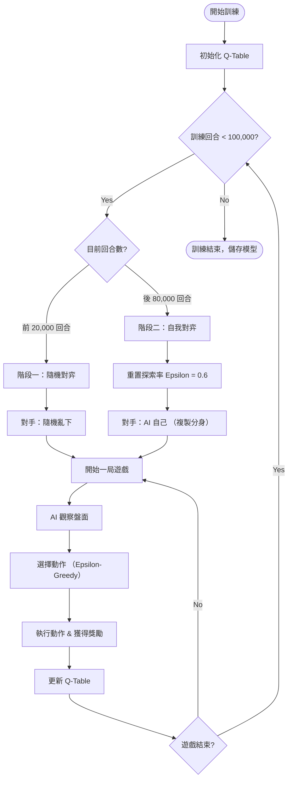
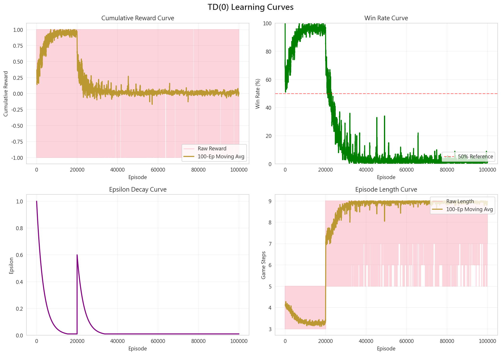

# 強化學習期末專題報告：基於 Q-Learning 演算法之井字棋 AI 實作

## 1. 專題摘要
本專題使用強化學習（Reinforcement Learning）中的 **Q-Learning** 演算法，訓練一個能夠自動學會玩井字棋（Tic-Tac-Toe）的 AI。本研究設計了一個「兩階段」的訓練流程：首先讓 AI 跟隨機亂下的對手練習，學會基本的連線規則；接著讓 AI 跟自己對打（自我對弈），學會防守與阻擋。經過 **100,000 次** 的訓練後，AI 從一開始的隨機落子，進化成一個會防守且難以被擊敗的高手，最終在對抗隨機對手時達到 96.9% 的勝率。

## 2. 遊戲規則與環境定義

### 2.1 井字棋規則
井字棋是一個雙人遊戲，雙方分別代表 **O** 與 **X**，輪流在 $3 \times 3$ 的格子中填入符號。
*   **獲勝條件**：最先將自己的三個符號連成一線（橫、直、對角線）的一方獲勝。
*   **平局條件**：若棋盤填滿了但沒有人連成一線，則為平局。

### 2.2 強化學習環境設置
為了讓 AI 能夠理解這個遊戲，本專題定義了以下三個要素：

1.  **狀態 (State)**：目前的棋盤盤面。
    *   **實作細節**：將 $3 \times 3$ 的二維陣列（0=空, 1=X, -1=O）扁平化為一維陣列，再轉換成字串作為 Q-Table 的索引鍵（Key）。
    *   例如：盤面中間有一個 X $\rightarrow$ 狀態表示為 `'[0, 0, 0, 0, 1, 0, 0, 0, 0]'`。
2.  **動作 (Action)**：AI 可以下在哪裡。
    *   也就是棋盤上所有還沒被填滿的「空格」座標（例如：`(1, 1)` 代表中間）。
3.  **獎勵 (Reward)**：用來告訴 AI 剛剛做得好不好。
    *   **贏了**：得 **+1 分**（給予正向回饋，鼓勵 AI 往這個方向走）。
    *   **輸了**：得 **-1 分**（給予懲罰，讓 AI 記住不要再導致這種局面）。
    *   **平手或還沒結束**：得 **0 分**（鼓勵儘速獲獲勝，不給予額外中間獎勵）。

## 3. 演算法說明

本專題使用的演算法是 **Q-Learning**，這是一種 Off-policy 的時序差分控制演算法。

### 3.1 Q-Table 定義與格式
Q-Table 是一個查找表（Look-up Table），用來儲存每一個「狀態-動作對 (State-Action Pair)」的價值。
*   **Row (列)**：代表棋盤的各種**狀態**。
*   **Column (行)**：代表可以採取的**動作**（下在 0~8 號哪個位置）。
*   **Value (值)**：代表 $Q(s, a)$，即在該狀態下採取該動作，**預期未來總共能拿幾分**。

**Q-Table 概念範例：**

假設現在 AI 持 X (先手)，盤面全空 `[0,0,0,0,0,0,0,0,0]`。

| 動作位置 (Action) | (0,0) 左上 | (0,1) 中上 | ... | (1,1) 中間 | ... |
| :--- | :---: | :---: | :---: | :---: | :---: |
| **Q 值 (預期分數)** | 0.2 | 0.1 | ... | **0.5** | ... |

**數值意義解釋：**
*   **數值範圍**：介於 **-1.0 到 +1.0** 之間。
    *   **接近 +1.0**：代表這一步走下去，贏面很大。
    *   **接近 -1.0**：代表這一步很糟糕，走下去很容易輸。
    *   **接近 0.0**：代表這一步可能導致平局。
*   **決策方式**：AI 查詢當前狀態的所有動作 Q 值，並選擇數值最高的那一格（如上表中的 0.5）。

### 3.2 動作選擇策略 ($\epsilon$-Greedy)
AI 在訓練過程中並非每次都選最高分的動作，而是採用 **$\epsilon$-Greedy (Epsilon-Greedy)** 策略來平衡「探索 (Exploration)」與「利用 (Exploitation)」：

*   **探索 (Exploration)**：以機率 $\epsilon$ (Epsilon) 隨機亂走，目的是為了發現新的更好策略。
*   **利用 (Exploitation)**：以機率 $1 - \epsilon$ 選擇 Q 值最大的動作，利用已知經驗來贏棋。

隨著訓練次數增加，$\epsilon$ 會逐漸變小（Decay），代表 AI 漸趨成熟，開始更多地依賴經驗。

### 3.3 學習公式 (Q-Learning Update)
每當 AI 下了一步棋並得到結果後，會依據以下公式更新 Q-Table 中對應的值：

$$Q(S, A) \leftarrow Q(S, A) + \alpha [ R + \gamma \max_{a'} Q(S', a') - Q(S, A) ]$$

**參數詳細說明：**
*   $Q(S, A)$：目前對這個動作的分數估計。
*   $R$ (Reward)：這一步得到的即時獎勵（除非贏了或輸了，否則通常是 0）。
*   $\max_{a'} Q(S', a')$：找出下一個狀態 $S'$ 中所有可能動作的最佳分數，讓 AI 具有遠見。
*   $\alpha$ (學習率, 0.1)：決定吸收新經驗的速度。
*   $\gamma$ (折扣因子, 0.99)：決定對未來獎勵的重視程度。

## 4. 訓練流程

本專題總共進行了 **100,000 場 (Episodes)** 的訓練，分為兩個階段。



### 4.1 第一階段：基礎訓練 (0 ~ 20,000 場)
*   **對手**：隨機機器人。
*   **目的**：快速讓 AI 學會「連成一線」的獲勝方式與基本遊戲規則。

### 4.2 第二階段：進階訓練 (20,000 ~ 100,000 場)
*   **對手**：AI 自己 (Self-Play)。
*   **目的**：學習防守。當對手變強（變回自己），若不阻擋對方的連線就會輸掉，這強迫 AI 修補策略漏洞。在此階段重置探索率，有助於開發新的防守思維。

## 5. 實驗結果與圖表分析

訓練過程中的數據記錄如下：



### 5.1 累積獎勵 (Cumulative Reward - 左上圖)
*   **階段一**：曲線接近 **1.0**，代表 AI 能輕易贏過隨機對手。
*   **階段二**：曲線掉到 **0.0** 附近。這並非退步，而是因為兩個強大的 AI 互不相讓，最後幾乎都以**平手**收場，這是達到最優策略的象徵。

### 5.2 勝率變化 (Win Rate - 右上圖)
*   進入自我對弈階段後，勝率下降且**平手率大幅上升**。這符合井字棋在最優對策下必為和局的理論。

### 5.3 最終評估
訓練結束後，讓 AI 與隨機對手進行 1000 場測試，結果如下：
*   **勝率**：96.9%
*   **敗率**：0.6%
*   **平手率**：2.5%

## 6. 結論
透過這次專題，驗證了：
1.  **Q-Learning 有效**：AI 成功將盤面狀態映射到最佳動作。
2.  **自我對弈是關鍵**：單靠隨機對手訓練無法讓 AI 學會防守，自我對弈是提升強度的關鍵。
3.  **訓練成果**：最終訓練出的 AI 能夠穩定擊敗弱對手，並在面對強大對手（包括人類玩家）時保持高度的不敗率。

## 7. 實作說明與參考文獻
本專題之程式碼由作者基於 Python 語言自行開發。環境設計參考了 OpenAI Gym 之標準介面規範；演算法實作則依據 Sutton & Barto 之強化學習理論，將 Q-Learning 演算法應用於井字棋賽局，並自行設計兩階段訓練流程。

**參考文獻：**
1.  Sutton, R. S., & Barto, A. G. (2018). *Reinforcement Learning: An Introduction* (2nd ed.). MIT Press.
2.  Watkins, C. J. C. H., & Dayan, P. (1992). *Q-learning*. Machine Learning, 8(3), 279-292.

## 8. 使用說明

### 8.1 環境準備 (僅腳本執行與訓練需要)
確保已安裝 Python 3.10+，並安裝必要套件：
```bash
pip install -r requirements.txt
```
*註：若僅執行 `dist/TicTacToe_AI.exe` 則不須安裝任何環境。*

### 8.2 執行遊戲
*   **直接執行 (推薦)**：雙擊 `dist/TicTacToe_AI.exe` 即可開始與 AI 對戰。
*   **腳本執行**：於終端機輸入 `python play_game.py`。

### 8.3 訓練 AI (可選)
若欲從零開始訓練模型，請於終端機輸入：
```bash
python main.py --mode train --episodes 100000
```
訓練完成後，新的模型將自動覆蓋 `models/td0_agent.pkl` 並同步更新分析圖表。